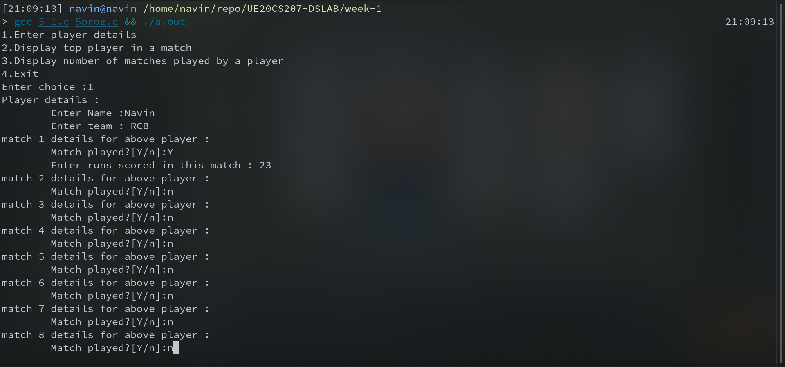

# Week-1 UE20CS207 DSLAB
- Name : P K Navin Shrinivas
- SRN : PES2UG20CS237
- Section : D
- Batch : 2

## Assginment problem 1 : Tower of Hanoi using recursion
### Code :
**main.c**
```c
#include<stdio.h>
typedef long long int ll;
#define intlimit 2147483647;
void tower_of_hanoi(int n , char from , char between , char to)
{
    if(n==1)
    {
        printf("From : %c to %c\n",from,to);
        return;
    }
    tower_of_hanoi(n-1,from,to,between);
    printf("From : %c to %c\n",from,to);
    tower_of_hanoi(n-1,between,from,to);
}
int main()
{
    //ios_base::sync_with_stdio(false);
    //cin.tie(NULL);
    
    //the number of moves needed by n disks is 2^n-1 always
    int n;
    printf("Enter number of disks : ");
    scanf("%d",&n);
    tower_of_hanoi(n,'A','B','C'); 
    //considering the three disks to be called A B and C

}

```
### Screenshots  :


## Assignment problem 2 : IPL players and data
### Code :
**main.c :**
```c
#include "5_1.h"


int main(){
    struct player pls[10000];
    int no_pl = 0;
    while(true)
    {

        int choice;
        printf("1.Enter player details\n");
        printf("2.Display top player in a match\n");
        printf("3.Display number of matches played by a player\n");
        printf("4.Exit \n");
        printf("Enter choice :");
        scanf("%d",&choice);
        if(choice==4)
            return 0;
        else if(choice == 1)
        {
            printf("Player details : \n");
            printf("\tEnter Name :");
            scanf("\t%[^\n]%*c",(pls+no_pl)->name);
            printf("\tEnter team : ");
            scanf("%[^\n]%*c",(pls+no_pl)->team);
            for(int i=0;i<14;i++)
            {
                printf("match %d details for above player :\n",i+1);
                printf("\tMatch played?[Y/n]:");
                char p;
                scanf("\t%c",&p);
                if(p=='n')
                {
                    (pls+no_pl)->match_data.score[i]=0;
                    (pls+no_pl)->match_data.played[i]=false;
                }
                else{
                    int s;
                    printf("\tEnter runs scored in this match : ");
                    scanf("%d",&s);
                    (pls+no_pl)->match_data.score[i]=s;
                    (pls+no_pl)->match_data.played[i]=true;
                }
               /* printf("%d",(pls+no_pl)->match_data.score[i]);*/   
            }
            no_pl++;
        }
        else if(choice == 2)
        {
            if(no_pl==0)
                printf("Bruh there is no data of players to search in");
            else{
                int mat;
                printf("Enter match number to find top player[0-13]: ");
                scanf("%d",&mat);
                int top = topplayer(pls,mat,no_pl);
                printf("Doing linear search on player data...\n");
                printf("Details of top scorer in this match : \n");
                printf("\tName : %s\n",(pls+top)->name);
                printf("\tTeam : %s\n",(pls+top)->team);
                printf("\tScore : %d\n",(pls+top)->match_data.score[mat]);
            }
        }
        else if(choice == 3)
        {
            printf("Enter player number [0-%d] :",no_pl-1);
            int pno;
            scanf("%d",&pno);
            int ret = matchpl(pls,pno);
            printf("\t Total number of matches played : %d \n",ret);
        }

    }
}
```
**5_1.h**
```c
#include<stdio.h>
#include<stdlib.h>
#include<stdbool.h>

struct matches{
    bool played[14];
    int score[14];
};

struct player{
    char name[20];
    char team[10];
    struct matches match_data;
};

int topplayer(struct player* pls , int mat , int no_pl);
int matchpl(struct player* pls , int pno);
```
**5_1.c**
```c
#include "5_1.h"

int topplayer(struct player* pls , int mat , int no_pl)
{
    int max_ind = 0;
    int max = pls->match_data.score[mat];
    for(int i=1;i<=no_pl;i++)
    {
        if((pls+i)->match_data.score[mat]>max)
        {
            max=(pls+i)->match_data.score[mat];
            max_ind=i;
        }
    }
    return max_ind;

}

int matchpl(strct player* pls , int pno)
{
    int played=0;
    for(int i=0;i<14;i++)//14 match details always
    {
        if((pls+pno)->match_data.played[i]==true)
            played++;
    }
    return played;
}
```
### Screenshots :



