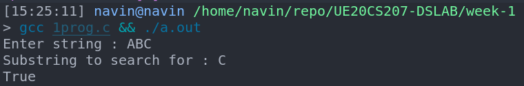
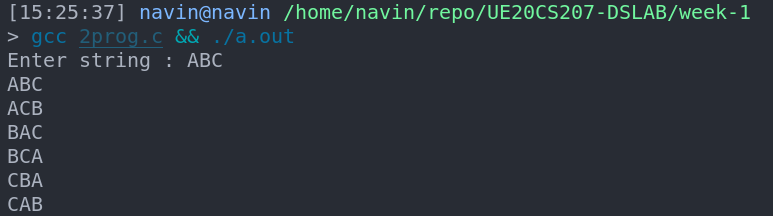

# Week-1 UE20CS207 DSLAB
- Name : P K Navin Shrinivas
- SRN : PES2UG20CS237
- Section : D
- Batch : 2

## program 1 : Recursion-1 substring check
### Code :
**main.c**
```c
#include<stdio.h>
#include<stdlib.h>
#include<string.h>
#include<stdbool.h>

bool recusrsesub(char* string , char* substring , int n , int start){
    int flag=1;
    for(int i=0;i<n;i++)
    {
        if(string[start+i]==substring[i])
            continue;
        else
        {
            flag=0;
            break;    
        }
    }
    if(flag==1)
        return true;
    else if(string[start]='\0')
        return false;
    else
        recusrsesub(string , substring , n , start+1);
}
int main(){
    char string[1000];
    char substring[1000];
    printf("Enter string : ");
    scanf("%[^\n]%*c",string);
    // // printf("The sting : %s",string);
    printf("Substring to search for : ");
    scanf("\t%[^\n]%*c",substring);
    int len = strlen(substring);
    if(recusrsesub(string , substring , len , 0))
        printf("True\n");
    else
        printf("False\n");
}
```
### Screenshots  :


## Program 2 : Recursion-2 All permutations of a given string
### Code :
**main.c :**
```c
#include<stdio.h>
#include<stdlib.h>
#include<string.h>
#include<stdbool.h>
void swap(char* str , int i , int j)
{
    char temp = str[i];
    str[i]=str[j];
    str[j]=temp;
}
void permute(char* str , int l , int r)
{
    if(l==r)
        printf("%s \n",str);
    else{
        for(int i=l;i<=r;i++)
        {
            swap(str,l,i);
            permute(str , l+1 ,r); // swapping terms recursively
            swap(str , l ,i);//return string to original
        }
    }
}
int main(){
    char str[1000];
    printf("Enter string : ");
    scanf("%[^\n]%*c",str);
    int n=strlen(str);
    permute(str , 0 , n-1);
}
```

### Screenshots :


