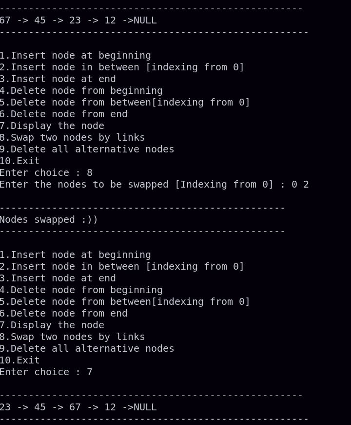
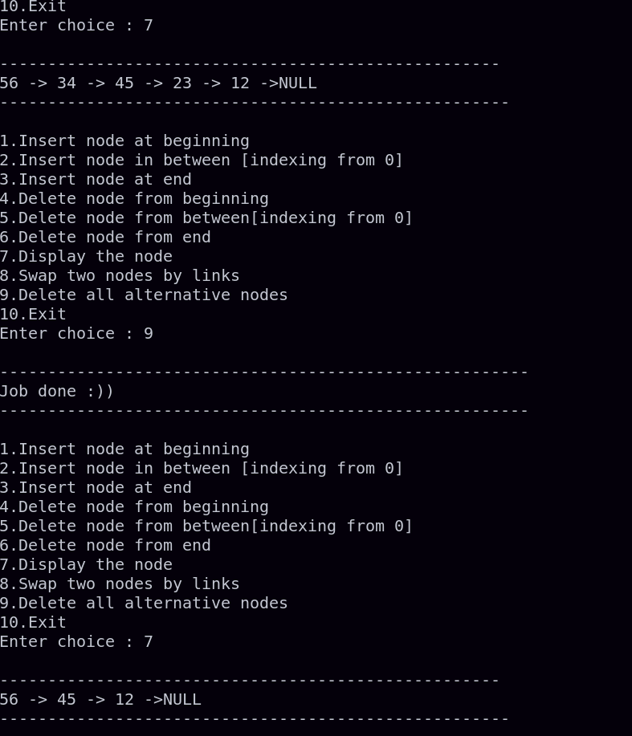
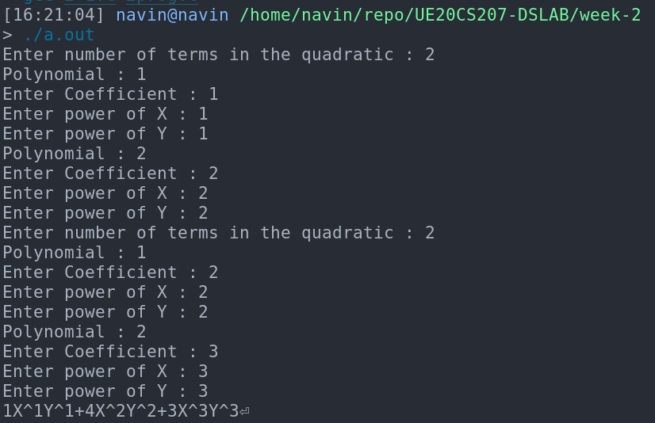

# Week-2 UE20CS207 DSLAB
- Name : P K Navin Shrinivas
- SRN : PES2UG20CS237
- Section : D
- Batch : 2

## Assginment problem 1 : Operations on a node , replacing without data , deleting alternative nodes
### Code :
**main.c**
```c

#include"1_1.h"

int main(){
    struct head* top = (struct head*)malloc(sizeof(struct head));
    top->nodes = 0;
    while(1)
    {   
        printf("\n1.Insert node at beginning\n");
        printf("2.Insert node in between [indexing from 0]\n");
        printf("3.Insert node at end\n");
        printf("4.Delete node from beginning\n");
        printf("5.Delete node from between[indexing from 0]\n");
        printf("6.Delete node from end\n");
        printf("7.Display the node\n");
        printf("8.Swap two nodes by links\n");
        printf("9.Delete all alternative nodes\n");
        printf("10.Exit\n");
        printf("Enter choice : ");
        int choice;
        scanf("%d",&choice);
        if(choice == 1)
        {
            int value;
            printf("Enter value : ");
            scanf("%d",&value);
            insertnode(top , 0 , value);
        }
        else if(choice == 2)
        {
            int value;int pos;
            printf("Enter value : ");
            scanf("%d",&value);
            displaylist(top);
            printf("Enter posistion [Indexing starts from 0] : ");
            scanf("%d",&pos);
            insertnode(top , pos , value);
        }
        else if(choice == 3)
        {
            int value;
            printf("Enter value : ");
            scanf("%d",&value);
            insertnode(top,top->nodes,value);
        }
        else if(choice == 4)
        {
            deletenode(top , 0);
        }
        else if(choice == 5)
        {
            int pos;
            displaylist(top);
            printf("Enter index to delete from : ");
            scanf("%d",&pos);
            deletenode(top , pos);
        }
        else if(choice == 6)
            deletenode(top , top->nodes);
        else if(choice == 7)
            displaylist(top);
        else if(choice == 8)
        {
            int index1,index2;
            printf("Enter the nodes to be swapped [Indexing from 0] : ");
            scanf("%d %d",&index1,&index2);
            if(index1<0 || index1>=top->nodes || index2<0 || index2>=top->nodes || index1 == index2)
                printf("Stop giving wrong indices!Thenks.\n");
            else
                nodeswap(top , index1 , index2);
            
        }
        else if(choice == 9)
        {
            alterdelete(top);
        }
        else if(choice == 10)
            return 0;
    }
}
```
**1_1.h**
```c
#include<stdio.h>
#include<stdlib.h>


struct head{
    struct node* link;
    int nodes;
};

struct node{
    int data;
    struct node* link;
};

void insertnode(struct head* top , int pos , int value);
void displaylist(struct head* top);
void deletenode(struct head* top,int pos);
void nodeswap(struct head* top , int index1 , int index2);
void alterdelete(struct head* top);
```
**1_1.c**

```c

#include "1_1.h"

void insertnode(struct head* top , int pos , int value)
{
    if(pos==0)//inseting at beginning
    {
        struct node* temp = (struct node*)malloc(sizeof(struct node));
        temp->data = value;
        temp->link = top->link;
        top->link = temp;
        top->nodes=top->nodes+1;
        printf("\n-------------------------------------------------\n");
        printf("Node inserted :)");
        printf("\n-------------------------------------------------\n");
    }
    else if(pos == top->nodes)
    {
        struct node* curr = top->link;
        while(curr->link!=NULL)
            curr=curr->link;
        struct node* temp = (struct node*)malloc(sizeof(struct node));
        temp->data=value;
        temp->link=NULL;
        curr->link=temp;
        top->nodes=top->nodes+1;
        printf("\n-------------------------------------------------\n");
        printf("Node inserted :)");
        printf("\n-------------------------------------------------\n");
        return;
    }
    else if(pos > top->nodes || pos<0)
    {
        printf("\n-------------------------------------------------\n");
        printf("Stawwp trying to break me with wrong index :(");
        printf("\n-------------------------------------------------\n");
        return;
    }
    else{
        struct node* curr = top->link;
        struct node* next = curr->link;
        int i=0;
        while(i!=pos-1)
        {
            curr=next;
            next=next->link;
            i++;
        }
        struct node* temp = (struct node*)malloc(sizeof(struct node));
        temp->data=value;
        curr->link=temp;
        temp->link=next;
        top->nodes=top->nodes+1;
        printf("\n-------------------------------------------------\n");
        printf("Node inserted :)");
        printf("\n-------------------------------------------------\n");
        return;
    }
}

void displaylist(struct head* top)
{
    if(top->nodes == 0)
    {
        printf("\n-------------------------------------------------\n");
        printf("The list has been empty all this time you doofus!");
        printf("\n-------------------------------------------------\n");
        return;
    }
    struct node* temp = top->link;
    printf("\n----------------------------------------------------\n");
    while(temp->link!=NULL)
    {
        printf("%d -> ",temp->data);
        temp=temp->link;
    }
    printf("%d ->NULL",temp->data);
    printf("\n-----------------------------------------------------\n");
    return;
}

void deletenode(struct head* top , int pos)
{
    printf("%d",top->nodes);
    if(pos > top->nodes)
    {
        printf("\n-------------------------------------------------\n");
        printf("Stawwp trying to break me with wrong index :(");
        printf("\n-------------------------------------------------\n");
        return;
    }
    else if(top->nodes == 0)
    {
        printf("\n-------------------------------------------------\n");
        printf("There exists no nodes to be delete you good sir!");
        printf("\n-------------------------------------------------\n");
    }
    else if(pos == 0)
    {
        struct node* delnode = top->link;
        top->link = delnode->link;
        free(delnode);
        top->nodes=top->nodes-1;
        printf("\n-------------------------------------------------\n");
        printf("Node deleted!");
        printf("\n-------------------------------------------------\n");
        return;
    }
    else if(pos == top->nodes)
    {
        struct node* prev = top->link;
        if(pos!=1)
        {
            struct node* delnode = prev->link;
            while(delnode->link!=NULL && delnode!=NULL)
            {
                prev=delnode;
                delnode=delnode->link;
            }
        }
        prev->link=NULL;
        top->nodes=top->nodes-1;
        printf("\n-------------------------------------------------\n");
        printf("Node deleted!");
        printf("\n-------------------------------------------------\n");
        return;
    }
    else{
        struct node* prev = top->link;
        struct node* delnode = prev->link;
        struct node* next = delnode->link;
        int i=1;//0 is handled by other cases luckily
        while(i!=pos)
        {
            prev=delnode;
            delnode=next;
            next=next->link;
            i++;
        }
        prev->link=next;
        free(delnode);
        top->nodes=top->nodes-1;
        printf("\n-------------------------------------------------\n");
        printf("Node deleted!");
        printf("\n-------------------------------------------------\n");
        return;

    }
}

void nodeswap(struct head* top , int index1 , int index2)
{
    if(index1 == 0 || index2 == 0)
    {
        //need to fetch only index2 node
        int i=1; //index2 can only be 1 or greater, also helps with while loop
        struct node* prev = top->link; //0
        struct node* curr = prev->link; //1
        while(i!=index2 && i!=index1) //trying and hadling both cases , shorter code
        {
            prev=curr;
            curr=curr->link;
            i++;
        }
        struct node* link0 = top->link->link;
        struct node* sublink = curr->link;
        //trying to swap nodes without extra vars is too confoosing,remember 4 lines for swap
        prev->link=top->link;
        prev->link->link=sublink;
        top->link=curr;
        curr->link=link0;
        printf("\n-------------------------------------------------\n");
        printf("Nodes swapped :))");
        printf("\n-------------------------------------------------\n");
        return;
    }
    else{
        if(index1 > index2)
        {
            int temp=index1;
            index1=index2;
            index2=temp;
        }//doing this so i can do dual retrieval using one loop
        //we need to fetch both index1 and index2 , hence dual retrieval
        struct node* prev1 = top->link;
        struct node* curr1 = prev1->link;
        struct node* prev2 = top->link;
        struct node* curr2 = prev2->link;
        int i=1,j=1;
        while(j!=index2)//index2 is always greater , link line 181
        {
            if(i!=index1)
            {
                prev1=curr1;
                curr1=curr1->link;
                i++;
            }
            prev2=curr2;
            curr2=curr2->link;
            j++;
        }
        struct node* link0=curr1->link;
        struct node* sublink=curr2->link;
        if(index2-index1==1)//near by elements , bruh this is a corner case :slam:
        {
            curr1->link=curr2->link;
            curr2->link=curr1;
            prev1->link=curr2;
            printf("\n-------------------------------------------------\n");
            printf("Nodes swapped :))");
            printf("\n-------------------------------------------------\n");
            return;

        }
        prev1->link=curr2;
        curr2->link=link0;
        prev2->link=curr1;
        curr1->link=sublink;
        printf("\n-------------------------------------------------\n");
        printf("Nodes swapped :))");
        printf("\n-------------------------------------------------\n");
        return;
    }
}

void alterdelete(struct head* top)
{
    if(top->nodes == 0)
    {
        printf("\n-------------------------------------------------------------------\n");
        printf("Dear sir, there are no nodes, and you expect me to delete somthing!!");
        printf("\n-------------------------------------------------------------------\n");

    }
    if(top->nodes == 1)
    {
        printf("\n-------------------------------------------------------\n");
        printf("Only one node exists , there is alternative node for it?");
        printf("\n-------------------------------------------------------\n");
        return;

    }
    struct node* curr = top->link;
    while(curr->link!=NULL && curr->link->link!=NULL)//need to check both to avoid seg faults
    {
        curr->link=curr->link->link;
        curr=curr->link;
    }
    printf("\n-------------------------------------------------------\n");
    printf("Job done :))");
    printf("\n-------------------------------------------------------\n");
}
```

### Screenshots  :



## Assignment problem 2 : Adding of two quadratics
### Code :
**main.c :**
```c

#include"2_1.h"

int main(){
    struct polytop* quad1 = (struct polytop*)malloc(sizeof(struct polytop));
    struct polytop* quad2 = (struct polytop*)malloc(sizeof(struct polytop));
    inputquad(quad1);
    inputquad(quad2);
    addquads(quad1,quad2);
    displayquad(quad1);
}
```
**2_1.h**
```c
#include<stdio.h>
#include<stdlib.h>
#include<stdbool.h>


struct polytop{
    struct poly* link;
};

struct poly{
    int coeff;
    int px;//power of x
    int py;//power of x
    struct poly* link; //link to next node
};
void inputquad(struct polytop* quad);
void displayquad(struct polytop* quad);
void addquads(struct polytop* quad1 , struct polytop* quad2);

```
**2_1.c**
```c

#include"2_1.h"
#include <stdio.h>
#include <stdlib.h>

void inputquad(struct polytop* quad)
{
    printf("Enter number of terms in the quadratic : ");
    int n;
    scanf("%d",&n);
    if(n==0)
    {
        quad->link=NULL;
        //yeah i actually have to do dis for stupid inputs as 
        //"All edge cases must be handled" crap
        return;
    }
    struct poly* temp=(struct poly*)malloc(sizeof(struct poly));
    printf("Polynomial : 1\n");
    printf("Enter Coefficient : ");
    scanf("%d",&(temp->coeff));
    printf("Enter power of X : ");
    scanf("%d",&(temp->px));
    printf("Enter power of Y : ");
    scanf("%d",&(temp->py));
    quad->link=temp;//the first node to be appending to

    struct poly* copy=quad->link;
    for(int i=1;i<n;i++)
    {
        struct poly* temp=(struct poly*)malloc(sizeof(struct poly));
        printf("Polynomial : %d\n",i+1);
        printf("Enter Coefficient : ");
        scanf("%d",&(temp->coeff));
        printf("Enter power of X : ");
        scanf("%d",&(temp->px));
        printf("Enter power of Y : ");
        scanf("%d",&(temp->py));
        copy->link=temp;
        copy=copy->link;
    }
    return;
}
void displayquad(struct polytop* quad)
{
    struct poly* curr = quad->link;
    if(quad->link == NULL)
    {
        printf("\nNo polynomials in the quad\n");
        return;
    }
    while(curr->link!=NULL)
    {
        printf("%dX^%dY^%d+",curr->coeff , curr->px , curr->py);
        curr=curr->link;
    }
    printf("%dX^%dY^%d",curr->coeff , curr->px , curr->py);
    
}
void addquads(struct polytop* quad1 , struct polytop* quad2)
{
    //adding quad2 onto quad1
    struct poly* curr = quad1->link;
    while(curr!=NULL)
    {
        struct poly* adder = quad2->link;
        while(adder!=NULL)
        {
            if(adder->px == curr->px && adder->py == curr->py)
            {
                curr->coeff=curr->coeff+adder->coeff;
            }
            adder=adder->link;
        }
        curr=curr->link;
    }
    curr=quad1->link;
    while(curr->link!=NULL)
        curr=curr->link;
    struct poly* temp = quad2->link;
    while(temp!=NULL)
    {
        int existflag=0;
        struct poly* temp2=quad1->link;
        while(temp2!=NULL)
        {
            if(temp2->px == temp->px && temp2->py==temp->py && existflag==0)
            {
                existflag=1;
                break;
            }
            temp2=temp2->link;
        }
        if(existflag)
            temp=temp->link;
        else{
            struct poly* newpoly=(struct poly*)malloc(sizeof(struct poly));
            newpoly->link=NULL;
            newpoly->px=temp->px;
            newpoly->py=temp->py;
            newpoly->coeff=temp->coeff;
            curr->link=newpoly;
            curr=curr->link;
            temp=temp->link;
        }
    }

}
```
### Screenshots :

