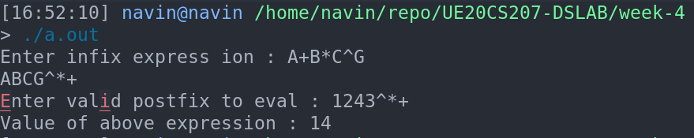
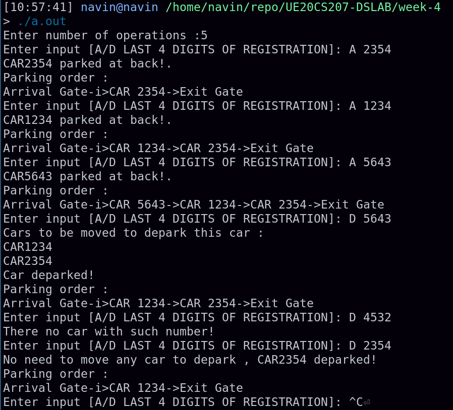

# Week-4 UE20CS207 DSLAB
- Name : P K Navin Shrinivas
- SRN : PES2UG20CS237
- Section : D
- Batch : 2

## Lab problem 1 : Infix to postfix , postfix evaluvation
### Code :
**main.c**
```c
#include"1_1.h"

int prec(char element)
{
    if(element=='^')
        return 3;
    else if(element=='*' || element=='/')
        return 2;
    else    
        return 1;
}

void inpo(char* stack , char* input , int* top)
{
    for(int i=0;i<strlen(input);i++)
    {
        if((input[i]>='a' && input[i]<='z') || (input[i]>='A' && input[i]<='Z'))
        {
            printf("%c",*(input+i));
        }
        else if(input[i]=='(')
            stackpush(stack , '(' , top);
        else if(input[i]==')')
        {
            while(stackpeek(stack , top)!='(')
            {
                printf("%c",stackpeek(stack , top));
                stackpop(stack , top);
            }
            stackpop(stack ,top);
        }
        else if(*top==-1 || prec(input[i])>prec(stackpeek(stack , top)))
        {
            stackpush(stack , input[i],top);
        }
        else{
            while(*top!=-1 && prec(input[i])<=prec(stackpeek(stack ,top)))
            {
                printf("%c",stackpeek(stack, top));
                stackpop(stack , top);
            }
            stackpush(stack,input[i],top);
        }
    }
    while(*top!=-1)
    {
        printf("%c",stackpeek(stack , top));
        stackpop(stack,top);
    }
}

void poeval(char* stack , char* input , int* top)
{
    for(int i=0;i<strlen(input);i++)
    {
        if((int)input[i]-48>=0 && (int)input[i]-48<=9)
            stackpush(stack,input[i],top);
        else{
            int temp=0;
            switch(input[i])
            {
                case '+':
                {
                    temp=(int)stackpeek(stack,top)-48;
                    stackpop(stack,top);
                    temp+=(int)stackpeek(stack,top)-48;
                    stackpop(stack,top);
                    stackpush(stack,(char)(temp+48),top);
                    break;
                }
                case '-':
                {
                    int copy=(int)stackpeek(stack,top)-48;
                    stackpop(stack,top);
                    int copy2=(int)stackpeek(stack,top)-48;
                    temp=copy2-copy;
                    stackpop(stack,top);
                    stackpush(stack,(char)(temp+48),top);
                    break;
                }
                case '*':
                {
                    temp=(int)stackpeek(stack,top)-48;
                    stackpop(stack,top);
                    temp*=(int)stackpeek(stack,top)-48;
                    stackpop(stack,top);
                    stackpush(stack,(char)(temp+48),top);
                    break;
                }
                case '/':
                {
                    temp=(int)stackpeek(stack,top)-48;
                    stackpop(stack,top);
                    temp/=(int)stackpeek(stack,top)-48;
                    stackpop(stack,top);
                    stackpush(stack,(char)(temp+48),top);
                    break;
                }
            }
        }
    }
}


int main(){
    char stack[STACKSIZE];
    int top=-1;
    printf("Enter infix express ion : ");
    char input[100];
    scanf("%s",input);
    inpo(stack , input , &top);
    printf("\n");
    printf("Enter valid postfix to eval : ");
    char input2[100];char stack2[STACKSIZE];int top2=-1;
    scanf("%s",input2);
    poeval(stack2 , input2 , &top2);
    printf("Value of above expression : %d\n",(int)stackpeek(stack2,&top2)-48);

}
```
**1_1.h**
```c
#include<stdio.h>
#include<stdlib.h>
#include<string.h>

#define STACKSIZE 100
void stackpush(char* stack , char element , int* top);
char stackpeek(char* stack , int* top);
void stackpop(char* stack , int* top);
```
**1_1.c**

```c
#include "1_1.h"

void stackpush(char* stack , char element , int* top)
{
    if(*top==STACKSIZE-1)
    {
       printf("Stack is full");
       return;
    }
    else{
        *top+=1;
        *(stack+*top)=element;
    }
}
char stackpeek(char* stack , int* top)
{
    return *(stack+*top);
}
void stackpop(char* stack , int* top)
{
    *top-=1;
    return;
}
```

### Screenshots  :


## Assignment problem 2 : Adding of two quadratics
### Code :
**main.c :**
```c
#include "2_1.h"
#include <stdio.h>

int main(){
    int queue[QUEUESIZE];
    int top=-1,front=-1;
    printf("Enter number of operations :");
    int n;
    scanf("%d",&n);
    int t=0;
    while(t!=n)
    {
        t++;
        printf("Enter input [A/D LAST 4 DIGITS OF REGISTRATION]: ");
        char op;int num_plate;
        scanf("\t%c %i",&op,&num_plate);
        if(op=='A') 
        {
            carpark(queue,&top,&front,num_plate);
        }
        else{
            cardepark(queue,&top,&front,num_plate);
        }

    }
}
```
**2_1.h**
```c
#include<stdio.h>
#include<stdlib.h>
#include<string.h>
#include<math.h>
#include<stdbool.h>

#define QUEUESIZE 8

void carpark(int* queue , int* top , int* front,int e);
void cardepark(int* queue,int* top,int* front,int e);
void queuepop(int* queue,int* top , int* front);
void queuepeek(int* queue , int* top , int* front);
void queuedisplay(int* queue , int* top, int* front);
```
**2_1.c**
```c
#include"2_1.h"
#include <stdio.h>

void carpark(int* queue , int* top , int* front,int e)
{
    if(*top == QUEUESIZE-1)
    {
        printf("CAR %d Entry->Out![No space available]\n",e);
    return;
    }
    else if(*top==-1 && *front==-1)
    {
        *top=0;
        *front=0;
        *(queue+*top)=e;
        printf("CAR%d parked at back!.\n",*(queue+*top));
        printf("Parking order : \n");
        printf("Arrival Gate-i>");
        for(int i=*top;i>=*front;i--)
        {
            printf("CAR %d->",*(queue+i));
        }
        printf("Exit Gate\n");
        return;
    }
    else{
        *top=*top+1;
        *(queue+*top)=e;
        printf("CAR%d parked at back!.\n",*(queue+*top));
        printf("Parking order : \n");
        printf("Arrival Gate-i>");
        for(int i=*top;i>=*front;i--)
        {
            printf("CAR %d->",*(queue+i));
        }
        printf("Exit Gate\n");

        return;

    }
}

void cardepark(int* queue,int* top,int* front,int e)
{
    int present_flag=0;
    int i=0;
    for(i=*top;i>=*front;i--)
    {
        if(*(queue+i)==e)
        {
            present_flag=1;
            break;
        }
    }
    if(present_flag==0)
    {
        printf("There no car with such number!\n");
        return;
    }
    int copy=i;
    if(copy>*front)
    {
        printf("Cars to be moved to depark this car : \n");
        for(i=copy-1;i>=*front;i--)
            printf("CAR%d\n",*(queue+i));
        for(int j=copy;j>=*front-1;j--)
            *(queue+j)=*(queue+j-1);
        *front=*front+1;
        printf("Car deparked!\n");
        printf("Parking order : \n");
        printf("Arrival Gate-i>");
        for(int i=*top;i>=*front;i--)
        {
            printf("CAR %d->",*(queue+i));
        }
        printf("Exit Gate\n");


    }
    else{
        printf("No need to move any car to depark , CAR%d deparked!\n",e);
        queuepop(queue,top,front);
        printf("Parking order : \n");
        printf("Arrival Gate-i>");
        for(int i=*top;i>=*front;i--)
        {
            printf("CAR %d->",*(queue+i));
        }
        printf("Exit Gate\n");

    }
}

void queuepop(int* queue,int* top , int* front)
{
    if(*top==-1 && *front==-1)
    {
        printf("Queue Underflow!!!\n");
        return;
    }
    else if(*front == *top)
    {
        *top=-1;
        *front=-1;
        return;
    }
    else
    {
        *front=*front+1;
    }
}

void queuepeek(int* queue , int* top , int* front)
{
    printf("Front of queue : %d\n",*(queue+*front));
    printf("Top of queue : %d\n",*(queue+*top));
    return;
}

void queuedisplay(int* queue , int* top, int* front)
{
    int end=*top;
    printf("Start of queue ->");
    for(int i=*front;i<=end;i++)
        printf("%d ->",*(queue+i));
    printf("End of queue\n");
}
```
### Screenshots :

