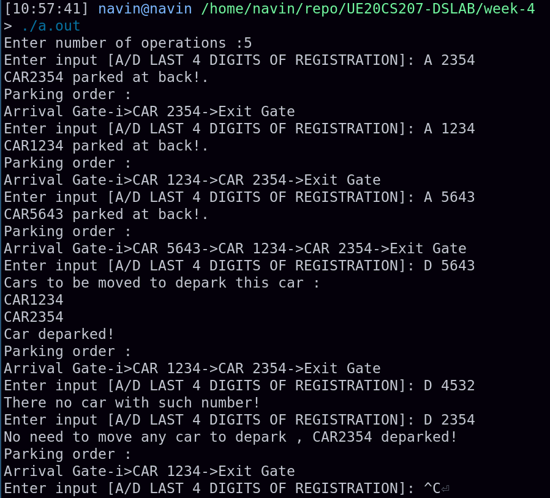
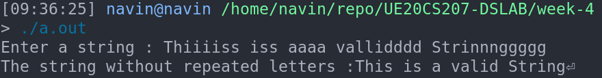

# Week-4 UE20CS207 DSLAB
- Name : P K Navin Shrinivas
- SRN : PES2UG20CS237
- Section : D
- Batch : 2

## Assignment problem: Parking problem
### Code :
**main.c**
```c
#include "2_1.h"
#include <stdio.h>

int main(){
    int queue[QUEUESIZE];
    int top=-1,front=-1;
    printf("Enter number of operations :");
    int n;
    scanf("%d",&n);
    int t=0;
    while(t!=n)
    {
        t++;
        printf("Enter input [A/D LAST 4 DIGITS OF REGISTRATION]: ");
        char op;int num_plate;
        scanf("\t%c %i",&op,&num_plate);
        if(op=='A') 
        {
            carpark(queue,&top,&front,num_plate);
        }
        else{
            cardepark(queue,&top,&front,num_plate);
        }

    }
}
```
**2_1.h**
```c
#include<stdio.h>
#include<stdlib.h>
#include<string.h>
#include<math.h>
#include<stdbool.h>

#define QUEUESIZE 8

void carpark(int* queue , int* top , int* front,int e);
void cardepark(int* queue,int* top,int* front,int e);
void queuepop(int* queue,int* top , int* front);
void queuepeek(int* queue , int* top , int* front);
void queuedisplay(int* queue , int* top, int* front);
```
**2_1.c**

```c
#include"2_1.h"
#include <stdio.h>

void carpark(int* queue , int* top , int* front,int e)
{
    if(*top == QUEUESIZE-1)
    {
        printf("CAR %d Entry->Out![No space available]\n",e);
    return;
    }
    else if(*top==-1 && *front==-1)
    {
        *top=0;
        *front=0;
        *(queue+*top)=e;
        printf("CAR%d parked at back!.\n",*(queue+*top));
        printf("Parking order : \n");
        printf("Arrival Gate-i>");
        for(int i=*top;i>=*front;i--)
        {
            printf("CAR %d->",*(queue+i));
        }
        printf("Exit Gate\n");
        return;
    }
    else{
        *top=*top+1;
        *(queue+*top)=e;
        printf("CAR%d parked at back!.\n",*(queue+*top));
        printf("Parking order : \n");
        printf("Arrival Gate-i>");
        for(int i=*top;i>=*front;i--)
        {
            printf("CAR %d->",*(queue+i));
        }
        printf("Exit Gate\n");

        return;

    }
}

void cardepark(int* queue,int* top,int* front,int e)
{
    int present_flag=0;
    int i=0;
    for(i=*top;i>=*front;i--)
    {
        if(*(queue+i)==e)
        {
            present_flag=1;
            break;
        }
    }
    if(present_flag==0)
    {
        printf("There no car with such number!\n");
        return;
    }
    int copy=i;
    if(copy>*front)
    {
        printf("Cars to be moved to depark this car : \n");
        for(i=copy-1;i>=*front;i--)
            printf("CAR%d\n",*(queue+i));
        for(int j=copy;j>=*front-1;j--)
            *(queue+j)=*(queue+j-1);
        *front=*front+1;
        printf("Car deparked!\n");
        printf("Parking order : \n");
        printf("Arrival Gate-i>");
        for(int i=*top;i>=*front;i--)
        {
            printf("CAR %d->",*(queue+i));
        }
        printf("Exit Gate\n");


    }
    else{
        printf("No need to move any car to depark , CAR%d deparked!\n",e);
        queuepop(queue,top,front);
        printf("Parking order : \n");
        printf("Arrival Gate-i>");
        for(int i=*top;i>=*front;i--)
        {
            printf("CAR %d->",*(queue+i));
        }
        printf("Exit Gate\n");

    }
}

void queuepop(int* queue,int* top , int* front)
{
    if(*top==-1 && *front==-1)
    {
        printf("Queue Underflow!!!\n");
        return;
    }
    else if(*front == *top)
    {
        *top=-1;
        *front=-1;
        return;
    }
    else
    {
        *front=*front+1;
    }
}

void queuepeek(int* queue , int* top , int* front)
{
    printf("Front of queue : %d\n",*(queue+*front));
    printf("Top of queue : %d\n",*(queue+*top));
    return;
}

void queuedisplay(int* queue , int* top, int* front)
{
    int end=*top;
    printf("Start of queue ->");
    for(int i=*front;i<=end;i++)
        printf("%d ->",*(queue+i));
    printf("End of queue\n");
}
```

### Screenshots  :


## Task problem: Remove all duplicate programs
### Code :
**main.c**
```c
#include "3_1.h"
#include <stdio.h>
#include <stdlib.h>

int main(){
    struct stack* st=(struct stack*)malloc(sizeof(struct stack));
    st->top=-1;
    char input[100];
    printf("Enter a string : ");
    scanf("\t%[^\n]%*c",input);
    for(int i=0;i<strlen(input);i++)
    {
        if(i==0)
            pushe(st,input[i]);
        else{
            if(peekstack(st)!=input[i])
                pushe(st,input[i]);
            else
                continue;
        }
    }
    printf("The string without repeated letters :");
    displaystack(st);
   
}
```
**3_1.h**
```c
#include<stdio.h>
#include<stdlib.h>
#include<string.h>
#include<math.h>
#include<stdbool.h>

#define STACKSIZE 100

struct stack{
    int top;
    char data[STACKSIZE];
};

void pushe(struct stack* st , char d);
void displaystack(struct stack* st);
char peekstack(struct stack* st);

```
**3_1.c**

```c
#include"3_1.h"

void pushe(struct stack* st , char d)
{
    if(st->top == STACKSIZE-1)
    {
        return;
   }
    else{
        (st->top)++;
        st->data[st->top]=d;
        return;
    }
}

void displaystack(struct stack* st)
{
    for(int i=0;i<=st->top;i++)
    {
        printf("%c",st->data[i]);
    }
}

char peekstack(struct stack* st)
{
    return st->data[st->top];
}
```

### Screenshots  :


